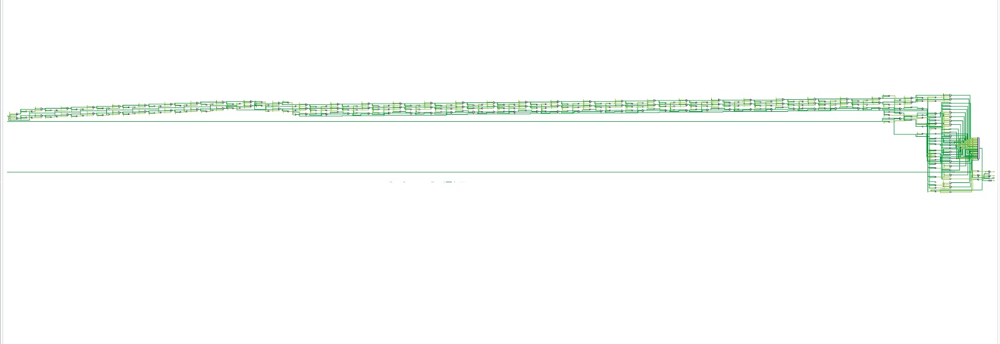
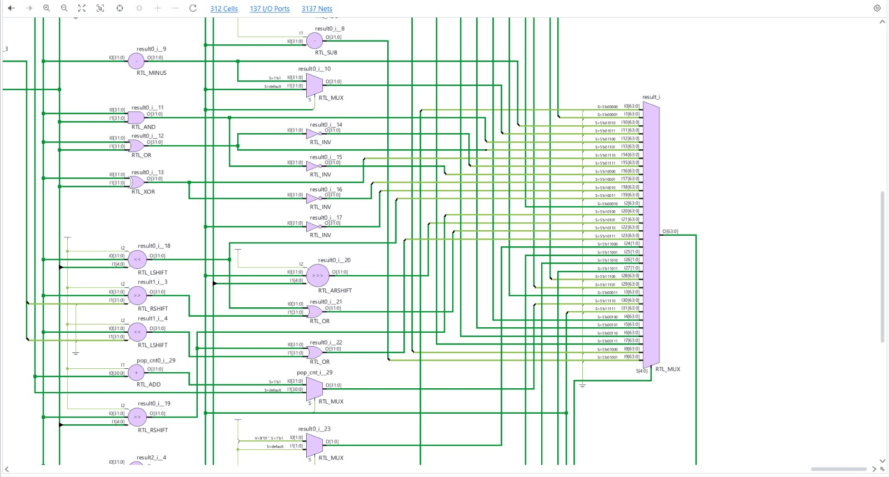
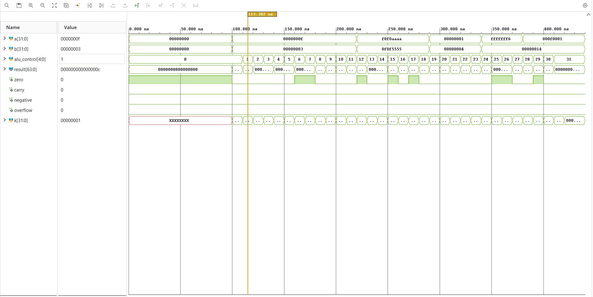
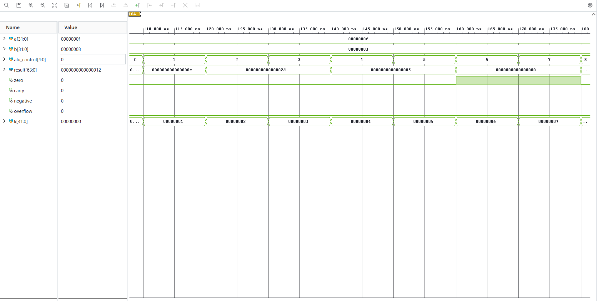

# OmniALU-32
### 32-Bit High-Performance Verilog Execution Unit

[](https://en.wikipedia.org/wiki/Verilog)
[](https://www.xilinx.com/products/design-tools/vivado.html)
[](LICENSE)

**OmniALU-32** is a fully combinational 32-bit Arithmetic Logic Unit (ALU) written in Verilog HDL. Designed for seamless integration into 32-bit RISC processor pipelines, it features an extended **5-bit opcode select decoder (32 discrete operations)**, a full **64-bit precision output vector**, and comprehensive hardware status flag generation.

---

## Key Hardware Architectural Features

* **Dual 32-Bit Input Buses:** Operates on operands `a[31:0]` and `b[31:0]`.
* **64-Bit Multi-Precision Output:** Full 64-bit output bus (`result[63:0]`) eliminating precision truncation during unsigned and signed 32-bit multiplications.
* **32-Opcode Command Decoder:** Driven by a 5-bit opcode line (`alu_control[4:0]`) covering Arithmetic, Logic, Shift/Rotate, Comparison, and Bit Manipulation categories.
* **Continuous Hardware Status Flags:**
  * **Zero Flag (`zero`)**: Evaluates high when `result == 64'd0`.
  * **Carry Flag (`carry`)**: Captures 33rd-bit carry out during unsigned 32-bit addition.
  * **Negative Flag (`negative`)**: Reflected directly from MSB (`result[63]`).
  * **Overflow Flag (`overflow`)**: Flags 2's complement arithmetic overflow on signed addition/subtraction.

---

## Complete Opcode Architecture Map

| Opcode (`alu_control`) | Operation Code | Category | Hardware Logic Description |
| :---: | :---: | :---: | :--- |
| `00` (`5'b00000`) | **ADD** | Arithmetic | 32-bit Addition ($A + B$) |
| `01` (`5'b00001`) | **SUB** | Arithmetic | 32-bit Subtraction ($A - B$) |
| `02` (`5'b00010`) | **MUL_U** | Arithmetic | Unsigned Multiplication ($A \times B \rightarrow 64\text{-bit}$) |
| `03` (`5'b00011`) | **MUL_S** | Arithmetic | Signed Multiplication ($A \times B \rightarrow 64\text{-bit}$) |
| `04` (`5'b00100`) | **DIV_U** | Arithmetic | Unsigned Division ($A / B$) with divide-by-zero protection |
| `05` (`5'b00101`) | **DIV_S** | Arithmetic | Signed Division ($A / B$) |
| `06` (`5'b00110`) | **MOD_U** | Arithmetic | Unsigned Modulo ($A \% B$) |
| `07` (`5'b00111`) | **MOD_S** | Arithmetic | Signed Modulo ($A \% B$) |
| `08` (`5'b01000`) | **INC** | Arithmetic | Increment ($A + 1$) |
| `09` (`5'b01001`) | **DEC** | Arithmetic | Decrement ($A - 1$) |
| `0A` (`5'b01010`) | **NEG** | Arithmetic | 2's Complement Negation ($-A$) |
| `0B` (`5'b01011`) | **ABS** | Arithmetic | Absolute Value ($\Vert{}A\Vert{}$) |
| `0C` (`5'b01100`) | **AND** | Bitwise Logic | Bitwise AND ($A \ \ \& \ \ B$) |
| `0D` (`5'b01101`) | **OR** | Bitwise Logic | Bitwise OR ($A \ \mid \ B$) |
| `0E` (`5'b01110`) | **XOR** | Bitwise Logic | Bitwise XOR ($A \ \oplus \ B$) |
| `0F` (`5'b01111`) | **NOR** | Bitwise Logic | Bitwise NOR ($\sim(A \ \mid \ B)$) |
| `10` (`5'b10000`) | **NAND** | Bitwise Logic | Bitwise NAND ($\sim(A \ \ \& \ \ B)$) |
| `11` (`5'b10001`) | **XNOR** | Bitwise Logic | Bitwise XNOR ($\sim(A \ \oplus \ B)$) |
| `12` (`5'b10010`) | **NOT** | Bitwise Logic | Bitwise Inversion ($\sim A$) |
| `13` (`5'b10011`) | **LSH** | Shift / Rotate | Logical Shift Left ($A \ll B[4:0]$) |
| `14` (`5'b10100`) | **RSH** | Shift / Rotate | Logical Shift Right ($A \gg B[4:0]$) |
| `15` (`5'b10101`) | **ARSH** | Shift / Rotate | Arithmetic Shift Right ($A \ggg B[4:0]$) |
| `16` (`5'b10110`) | **ROL** | Shift / Rotate | Circular Bit Rotate Left |
| `17` (`5'b10111`) | **ROR** | Shift / Rotate | Circular Bit Rotate Right |
| `18` (`5'b11000`) | **SLT** | Comparison | Set Less Than (Signed) |
| `19` (`5'b11001`) | **SLTU** | Comparison | Set Less Than (Unsigned) |
| `1A` (`5'b11010`) | **SEQ** | Comparison | Set Equal |
| `1B` (`5'b11011`) | **SNE** | Comparison | Set Not Equal |
| `1C` (`5'b11100`) | **CLZ** | Bit Manip. | Count Leading Zeros |
| `1D` (`5'b11101`) | **CTZ** | Bit Manip. | Count Trailing Zeros |
| `1E` (`5'b11110`) | **POPCNT** | Bit Manip. | Population Count (Count set 1-bits) |
| `1F` (`5'b11111`) | **BREV** | Bit Manip. | Bit Order Reversal |

---

## Hardware Elaboration & Synthesis Schematics

### 1. Top-Level Elaborated RTL Overview
Top-level structural overview showing parallel hardware execution units generated during RTL synthesis:



### 2. Central Output Multiplexer Structure
Detailed view of the 32-to-1 output routing multiplexer (`RTL_MUX`) driving the 64-bit output vector `result[63:0]`:



---

## Behavioral Simulation Verification

### 1. Full 32-Opcode Execution Timeline
Complete simulation waveform verifying sequential operation execution across opcodes `00` to `1F` (`0` to `31`):



### 2. Arithmetic Set Verification (Opcodes 00 - 07)
Detailed cycle-accurate view verifying arithmetic operations including addition, subtraction, signed/unsigned multiplication, division, and modulo operations:



---

## How to Run & Verify

1. **Clone Repository:**
   ```bash
   git clone [https://github.com/kiran-circuits/OmniALU-32.git](https://github.com/kiran-circuits/OmniALU-32.git)